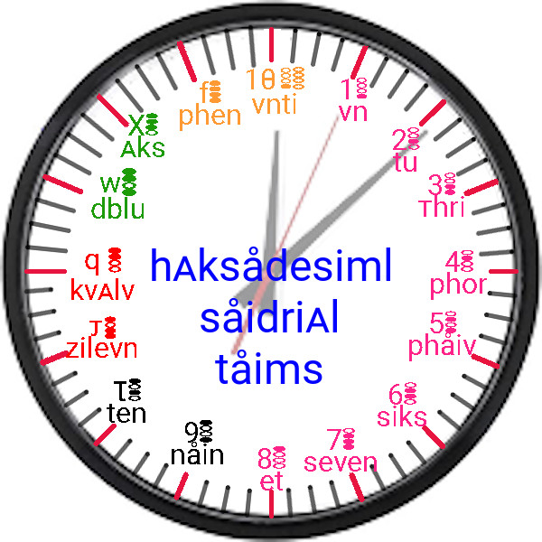
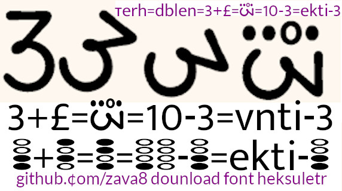

# [repl.it clang build command](https://replit.com/@zava8/plong) :
clang++-7 -pthread -std=c++17 -o main src/cplongekseption.cpp src/cplong.cpp src/main.cpp

## linux g++/clang++ build command :
1. ~/maigit/eclp/plong $ **clang++ -o main src/cplongekseption.cpp src/cplong.cpp src/main.cpp**
2. ~/maigit/eclp/plong $ **g++ -o main src/cplongekseption.cpp src/cplong.cpp src/main.cpp**

####computing in 1 boat ( alu only ) :
1. [c8 vith plong library](https://github.com/zava8/plong)
2. [discuss n code phur c8](https://replit.com/@zava8/plong)

####india oriznl nmbr system :
1. heksadesiml(123456789LJQWXF 10=8+8=4*4)
2. precision layers : rupaiya(0th pl) , aana(-1th pl) ....

####historical instances oph india oriznl nmbr system :
[pach rupaiye barah aana](youtube.com/watch?v=wO5qkv6Fabg)

= pach rupaiye + barah aana

= (5, 0) + (Q, -1)

= (5, 0).dec_pl(-1) + (Q, -1)

= (50, -1) + (Q, -1)

= (50+Q , -1)

= (5Q, -1)

= 5Q:1 string representation 1 here means 1 layer belo 0th precision layer.

